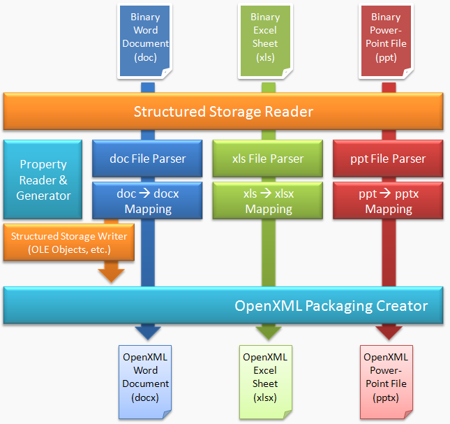
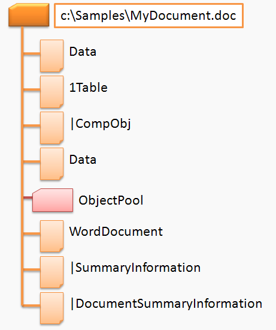
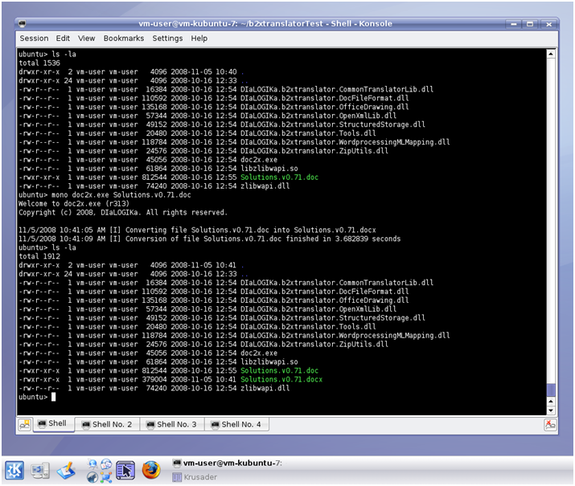

# Office Binary (doc, xls, ppt) Translator to Open XML by DIaLOGIKa

## Menu

* [About](./README.md)
* [User Documentation](./documentation.md)
* [Known Issues](./features.md)
* [Supplementary Downloads](./download.md)

### Table of Contents

* [File Format Documentation](#file-format-documentation)
* [High-Level Architecture Description](#high-level-architecture-description)
* [Streams in a Word Document](#streams-in-a-word-document)
* ["How to" Guides](#"how-to"-guides)
* [Platform Interoperability](#platform-interoperability)
* [Feature Mapping](#feature-mapping)

### File Format Documentation

**Office Binary File Formats**

* [Initial version of February 2008](http://www.microsoft.com/interop/docs/officebinaryformats.mspx)
* [Improved version of June 2008](http://msdn.microsoft.com/en-us/library/cc313105.aspx)

**Office Open XML**

* [ECMA-376 1st and 2nd Edition](http://www.ecma-international.org/publications/standards/Ecma-376.htm)
* [ISO/IEC 29500](http://www.iso.org/iso/iso_catalogue/catalogue_tc/catalogue_detail.htm?csnumber=51463)
* [Implementation notes for ECMA-376 1st Edition](http://www.documentinteropinitiative.org/ECMA-376/reference.aspx)

### High-Level Architecture Description

Structured storage (also known as compound file) is a technology to store hierarchical data within a single file. Microsoft Office uses the structured storage as a container for storing binary Office documents (doc, xls, ppt), but also for storing some special objects such as macros in an Open XML document. Information about the StructuredStorage class we are using in this translator project can be found [here](./download.md#structured-storage-class).

Such a structured storage container is made up of a number of virtual streams which contain text, data and control structures of the binary Office documents, i.e. the container is like a small file system of its own. The content of these streams or subfiles is document type-specific, i.e. Word documents contain other streams than Excel spreadsheets or PowerPoint presentations.

Consequently, we have to tackle two levels of format interpretation:

* understanding the structured storage format and extracting the individual streams
* interpreting the document type-specific streams and building an internal data structure

Subsequently, these internal data structures will then be translated to equivalent Open XML element structures using mapping tables (these mapping tables are also document type-specific; a very initial version of a doc to docx mapping table can be found [here](#feature-mapping)).

In a last step, the Open XML element structures are assembled into an Open XML package file. This might also require, e.g. for macros, a structured storage container to be created in the Open XML document (cf. *Structured Storage Writer* in the diagram below).

The diagram below shows a high-level view of the architecture of the *Office Binary (doc, xls, ppt) Translator to Open XML* project (Note: Since all the binary Office formats use the same approach for storing meta data, the *Property Reader & Generator* component can be used for all document types).



We focused in the first phase of this project on the translation of binary Word documents to Open XML Word documents (doc to docx). The other two translators have been developed in phase II and phase III of the project.

### Streams in a Word Document

A binary Word file (doc) consists of the following streams inside the structured storage (the stream structure of the two other binary formats is similar. They will be explained in a paper of its own):

* main stream (*WordDocument*)
* summary information stream (the summary information for a Word document is actually stored in two structured storage streams,
*SummaryInformation* and *DocumentSummaryInformation*)
* table stream (*0Table* or *1Table*)
* data stream (optional, *Data*)
* custom XML storage (optional, added in Word 2007)
* 0 or more object streams which contain private data for embedded objects within the Word document

The diagram below shows the streams in a sample Word document



### "How to" Guides

During the development of the binary translators we encountered a number of challenging and tricky data structures in the binary Office formats. In addition, the file format specifications are not always precise enough (in particular, the previous versions did not contain any examples!).

We have compiled the experience we've made in a number of "how to" guides which might be quite useful for other developers but also for Microsoft to improve the binary file format specifications.

On June 30, 2008 Microsoft released new technical specifications for the binary formats. They can be downloaded from [http://msdn.microsoft.com/en-us/library/cc216514.aspx]. More or less all the problems we have encountered in the old formats specification have been fixed and a considerable number of examples has been added. Consequently, the remarks concerning the formats specification we have made in our documents below refer to the old specification mainly!

* [Freeform Shapes in the Office Drawing Format](./howtos/Freeform_Shapes_in_the_Office_Drawing_Format.pdf)

  Word, Excel and Powerpoint have the feature to draw custom shapes (scribble lines or self defined polygons). This text shows how such freeform shapes are stored in the files.

* [How to Retrieve Text from a Binary .doc File](./howtos/How_to_retrieve_text_from_a_binary_doc_file.pdf)

  It's a bit tricky to extract the text contained in a binary Word document; however, we've managed it. Have a look in the document to read more details.

* [A Guide to Table Formatting](./howtos/A_guide_to_table_formatting.pdf)

  Table formatting is another demanding conversion task.

* [The Storage of Macros and OLE Objects](./howtos/The_Storage_of_Macros_and_OLE_Objects.pdf)

  This document gives an overview on the implementation of macros and OLE objects in Microsoft's binary Office file format. It explains how they are stored in a binary Word file and why it doesn't take a specification to convert them to the new Open XML Format.

### Platform Interoperability

Running the Binary Office to OpenXML under Linux or other non-Windows platforms? No problem!
It works out of the box! You only have to install [Mono](http://www.mono-project.com/Main_Page). Just execute doc2x.exe with Mono and see how it works:

``` BASH
mono doc2x.exe <file_name>
```

We tested doc2x.exe in a kubuntu-VM with Mono JIT compiler version 1.2.3.1:



### Feature Mapping

**Word (doc/docx):**

The following features are implemented in the M2 Release of the doc/docx translator (this is quite a high level view of the feature mapping, a more detailed mapping table is available in [XLSX](./documents/Draft_Binary_OpenXML_Mapping%20(doc-docx_v2.0).xlsx) or [PDF format](./documents/Draft_Binary_OpenXML_Mapping%20(doc-docx_v2.0).pdf)):

* Part Mapping
  * Main document
  * Headers
  * Footers
  * Styles
  * Numberings
  * Customizations
* Basic Text Structure
  * Sections
  * Paragraphs
  * Runs
  * Tables
* Advanced Text Structure
  * Fields
  * Table of Contents
  * Revision data (track changes)
  * Comments
  * Floating paragraphs
* Text Formatting
  * Section formatting
  * Paragraph formatting
  * Character formatting
  * Table formatting
* Pictures
  * Inline pictures
  * Floating pictures
* Picture Formatting
  * Size and Position
  * Layout and Wrapping
  * Graphical Formatting
* Shapes
  * All shape types
* Shape Formatting
  * Size and Position
  * Layout and Wrapping
  * Graphical Formatting
  * Textbox Content
* OLE objects
* Macros
* Template translation
* Mono support
* Setup

---

**PowerPoint (ppt/pptx):**

An initial mapping from ppt to pptx and from xls to xlsx was planned for M2. This mapping covers the following features.

* ppt/pptx Mapping (a more detailed mapping table is available in [XLSX](./documents/Draft_Binary_OpenXML_Mapping%20(ppt-pptx_Phase%20III).xlsx) or [PDF format](./documents/Draft_Binary_OpenXML_Mapping%20(ppt-pptx_Phase%20III).pdf)):
  * Part Mapping
    * Presentation Metadata
    * Slide Masters
    * Slides
    * Content Masters
    * Color Mapping
    * Themes
  * Slide content
    * Text / Text Runs

---

**Excel (xls/xlsx):**

* xls/xlsx Mapping (see also the [BiffView tool](./download.md#biffview-tool) for analysing the structure of a binary Excel sheet; a more detailed mapping table is available in [XLSX](./documents/Draft_Binary_OpenXML_Mapping%20(xls-xlsx_Phase%20III).xlsx) or [PDF format](./documents/Draft_Binary_OpenXML_Mapping%20(xls-xlsx_Phase%20III).pdf)):
  * Part Mapping
    * Worksheets
  * Worksheet Content
    * Strings
    * Numbers
  * Formatting
    * Merged Cells
