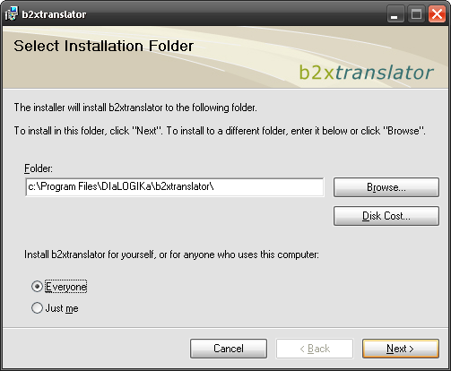
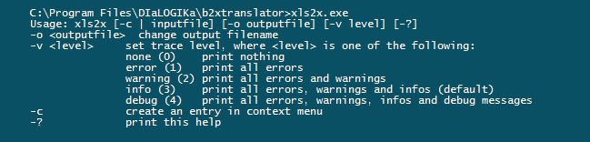
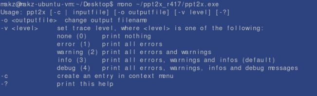
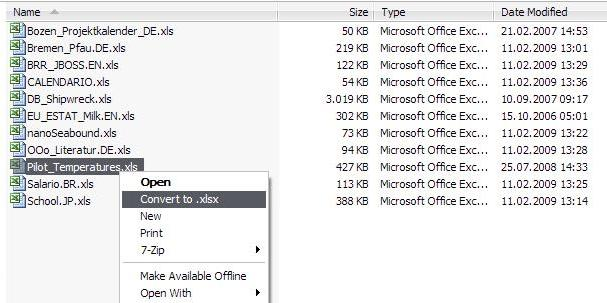
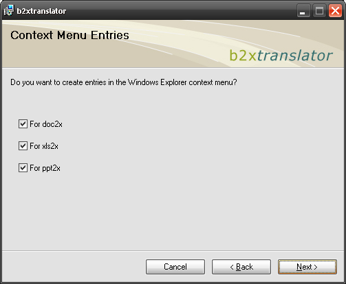
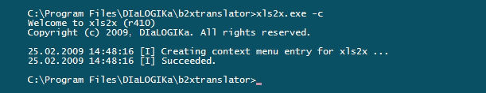

# Office Binary (doc, xls, ppt) Translator to Open XML by DIaLOGIKa

## Menu

* [About](./README.md)
* [Developer's Corner](./architecture.md)
* [Known Issues](./features.md)
* [Supplementary Downloads](./download.md)

### Table of Contents

* [Installing the Office Binary Translators](#installing-the-office-binary-translators)
* [Using the Office Binary Translators](#using-the-office-binary-translators)
* [Creating Context Menu Shortcuts](#creating-context-menu-shortcuts)
* [Software Requirements](#software-requirements)
* [Troubleshooting](#troubleshooting)

### Installing the Office Binary Translators

**Windows**

We have made the translator installation now simpler by providing one single MSI-based installation program for all translators (see screenshot below):

* Download the latest version from the [download section on SourceForge](https://sourceforge.net/project/showfiles.php?group_id=216787&package_id=261616) ([b2xtranslator_setup_r649.msi](https://sourceforge.net/project/downloading.php?group_id=216787&filename=b2xtranslator_setup_r649.msi&a=33560327))
* run the setup program 

As an alternative, you can also manually install the translator as follows:

* download the latest version of a translator as a compressed file package from the [download section on SourceForge](https://sourceforge.net/project/showfiles.php?group_id=216787&package_id=261616) e.g. [doc2x_r649.zip](https://sourceforge.net/project/downloading.php?group_id=216787&filename=doc2x_r649.zip&a=23723465).
* extract the zip file to a suitable folder on your hard disk, e.g. c:\Program Files\doc2x
* add the installation folder(s) to the PATH environment variable; thus, you don't need to specify the entire folder name when calling the translators

**Linux**

Installing the linux distribution is basically the same as installing the Windows .zip packages

* download the latest linux distribution [doc2x_r649.tar.gz](https://sourceforge.net/project/downloading.php?group_id=216787&filename=doc2x_r649.tar.gz&a=13775724) to your user folder
* Extract the package using the tar command in your user folder: tar -xzf doc2x_r478.tar.gz

### Using the Office Binary Translators

All translators are command line tools, i.e. they are normally started from a command prompt. The names of the executables are

* doc2x.exe
* xls2x.exe
* ppt2x.exe

Calling the translators without any parameter gives you some help information about the parameters as shown below

If you want to use the translators under linux you have to use the mono command:

If you want to try the translators you can download some sample files from out [test suite on the download page](https://sourceforge.net/project/showfiles.php?group_id=216787&package_id=261616).

### Creating Context Menu Shortcuts

Register the Binary Translator to Open XML in the context menus of the .doc, .xls and .ppt file formats and you can launch a translation from the binary formats to Open XML very easily as shown below.

The context menu registration can be done during setup (see below).

As an alternative, the command line tools support a special option that creates such an entry.
For example, if you want to create a context menu entry for xls2x just do that:

The above shown -c option works for all three translators.

[Back to Top](#menu)

### Software Requirements

**Windows**

The only prerequisite you have to install to use the Office Binary (doc, xls, ppt) Translator to Open XML is the [.NET Framework 2.0 or higher](http://www.microsoft.com/net/Overview.aspx)

**Linux**

Office Binary (doc, xls, ppt) Translator to Open XML requires the free, cross platform, open source .NET development framework "Mono". Mono is already installed on most of the available Linux distribution. If Mono is not installed, or the installed version is older than version 2.0 you will need to download the [latest version of Mono](http://www.go-mono.com/mono-downloads/download.html).

[Back to Top](#menu)

### Troubleshooting

Please report any problems you have when installing or using the Binary Translator to Open XML in the [SourceForge Bug & Feedback tracker](http://sourceforge.net/tracker/?atid=1038368&group_id=216787&func=browse).

Upon receiving your feedback on these issues we will describe in the future in this section to cope with problems when using the Binary Translator to Open XML.

[Back to Top](#menu)
