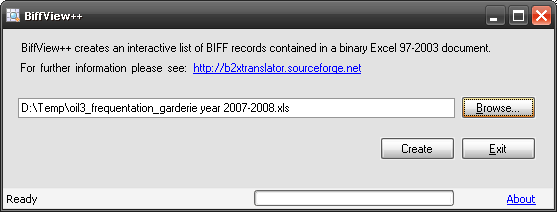
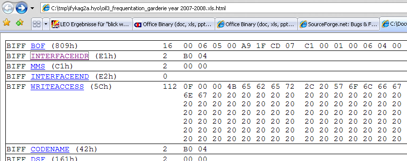
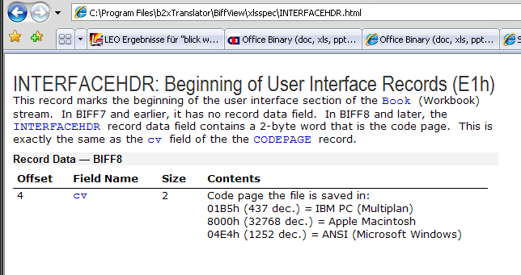
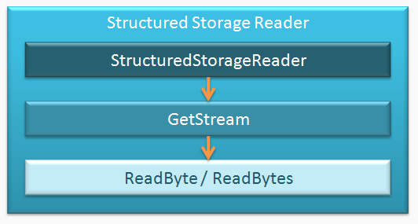
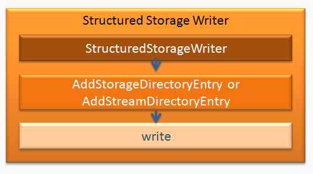

# Office Binary (doc, xls, ppt) Translator to Open XML by DIaLOGIKa

## Menu

* [About](./README.md)
* [User Documentation](./documentation.md)
* [Developer's Corner](./architecture.md)
* [Known Issues](./features.md)

### Table of Contents

* [Phase III Milestone 5](#phase-iii-milestone-5)
* [Older Downloads](#older-downloads)
* [BiffView Tool](#biffview-tool)
* [Structured Storage Class](#structured-storage-class) (Write support added)
* [Source Distribution](#source-distribution)

### Phase III Milestone 5

* Phase III Milestone 5 is now available in the download section on SourceForge.
* More information on Phase III of the Office Binary (doc) to OpenXML Translator (doc2x):
  * [Feature mapping list XLS2X](./documents/Draft_Binary_OpenXML_Mapping%20(xls-xlsx_Phase%20III).pdf)
  * [Feature mapping list PPT2X](./documents/Draft_Binary_OpenXML_Mapping%20(ppt-pptx_Phase%20III).pdf)
  * [Test plan for Word, PowerPoint and Excel](./documents/TP-MS_BINCONV.pdf)
  * [Test specification doc2x](./documents/Test_Specification_ppt2x.pdf)
  * [Test specification xls2x](./documents/Test_Specification_xls2x.pdf)
  * [Test specification ppt2x](./documents/Test_Specification_ppt2x.pdf)
  * [Test suite](./src/Test/)

### Older Downloads

* Phase II is still available in the [download section on SourceForge](http://sourceforge.net/project/showfiles.php?group_id=216787&package_id=261616&release_id=645069).
* Phase I is also still available in the [download section on SourceForge](http://sourceforge.net/project/showfiles.php?group_id=216787&package_id=261616&release_id=612281).
* Office Binary (doc, xls, ppt) Translator to Open XML 0.1 M1 Beta CTP

  This community technology preview release is a development snapshot demonstrating the project’s progress. It is not yet supporting the full feature set of Word documents. Currently converted features are:

  * Main document text
  * Style definitions
  * Most of the character and paragraph formatting available in Word
  * Basic table formatting and properties
  * Sections
  * Header and footer definitions
  * Revisions (Track Changes)

  Download:

  * [Office Binary (doc, xls, ppt) Translator to Open XML 0.1 M1 Beta - Community Technology Preview](http://downloads.sourceforge.net/b2xtranslator/b2xtranslator-0.1-M1-beta.zip)
  * [Sample documents](http://downloads.sourceforge.net/b2xtranslator/sample-documents.zip)

### BiffView Tool

Excel's underlying file format structure is also known as BIFF (Binary Interchange File Format). For analysis and debugging purposes we started the xls/xlsx mapping with the development of a small tool for viewing the BIFF structure of a binary Excel sheet.

Since this byproduct is quite useful for analysing an Excel sheet we decided to make it [available here](http://b2xtranslator.sourceforge.net/snapshots/BiffView.zip) as well.

**Installation and Usage Information**

To install BiffView just extract the [zip file](http://b2xtranslator.sourceforge.net/snapshots/BiffView.zip) to a suitable folder (e.g. c:\Program Files\BiffView).

Launch BiffView by double clicking BiffView.exe and select a binary Excel spreadsheet using the Browse button.

When clicking the Create button BiffView creates an HTML file which describes the structure of the Excel spreadsheet and opens this file in your browser.

Upon clicking one of the underlined structure elements, e.g. INTERFACEHDR, explanations about this element are given.

### Structured Storage Class

Structured storage (also known as compound file) is a technology to store hierarchical data within a single file. Microsoft Office uses the structured storage as a container for storing binary Office documents (doc, xls, ppt). In addition, it is used in OpenXML documents for storing OLE objects or macros.

Such a structured storage container is made up of a number of virtual streams which contain text, data and control structures of the binary Office documents, i.e. the container is like a small file system of its own. The content of these streams or subfiles is document type-specific, i.e. Word documents contain other streams than Excel spreadsheets or PowerPoint presentations.

Based on the compound binary file format specification [made available by Microsoft](http://www.microsoft.com/interop/docs/supportingtechnologies.mspx) we have developed a .NET/C# assembly to open and read such a structured storage file. For the latest version of the Office Binary (doc) to OpenXML Translator (doc2x) we have added support for creating and writing structured storage files, as well. As mentioned above, this is necessary for storing OLE objects and macros.

This assembly does not refer to any Windows API calls, thus, porting to another platform (e.g. using Mono) is feasible.

The assembly implements the following major classes:

* **StructuredStorageReader**
  Provides methods for accessing a compound file.
* **StructuredStorageWriter**
  Provides methods for writing a compound file.
* **RootDirectoryEntry / StorageDirectoryEntry / StreamDirectoryEntry**
  Provide methods for constructing the directory structure of a compound file.
* **VirtualStream**
  Encapsulates a virtual stream in a compound file.
* **VirtualStreamReader**
  Wrapper for reading from a virtual stream.

These classes implement the following main methods for accessing a virtual stream or for writing a compound file:

* **StorageReader(string fileName)**
  Opens the structured storage document *fileName*.
* **VirtualStream GetStream(string path)**
  Opens the stream *path* in a structured storage document opened using StorageReader.
* **byte[] ReadBytes(long position, int count); / byte ReadByte();**
  Reads one or more bytes from a stream.
* **StorageDirectoryEntry AddStorageDirectoryEntry(string name)**
  Adds a StorageDirectoryEntry to the directory structure.
* **void AddStreamDirectoryEntry(string name, Stream stream)**
  Adds a StreamDirectoryEntry associated with the Stream *stream* to the directory structure.
* **public void write(Stream outputStream)**
  Writes the generated compound file structure to the Stream *outputStream*.

Consequently, reading a stream in a structured storage consists of the following sequence of calls:

Writing a structured storage to a stream can be achieved as follows:

The package available for download additionally contains command line test applications:

* ***CompoundFileExtractTest***
  Usage: CompoundFileExtractTest.exe <file1> [<file2> ...]
  This test applications can be used to extract streams of one or more compound files. The streams of a given file are extracted to a folder with the same name as the file except the name is prefixed by '_' and occurrences of '.' are replaced by '_'.
* ***CompoundFileReadWriteExtractTest***
  Usage: CompoundFileReadWriteExtractTest.exe <file>
  This test applications can be used to extract streams of a compound file and reassemble it. The streams of a given file are extracted to a folder with the same name as the file except the name is prefixed by '_' and occurrences of '.' are replaced by '_'. The reassembled file is named: <original_name>_output.<original_extension>.

Download:

* [Latest snapshot of the Structured Storage Reader](http://b2xtranslator.sourceforge.net/snapshots/StructuredStorageSnapshot_r337.zip)

### Source Distribution

**Download**

You can download the complete source code from our download page on [SourceForge.net](https://sourceforge.net/project/showfiles.php?group_id=216787) (or here, obviously **Note Killyosaur**).

**Minimum Software Requirements**

To compile the source distribution, you will need Microsoft Visual Studio 2005 or the free Microsoft Visual C# 2005 Express edition. (this version may require a higher edition, I may have mucked around with it a bit :) **Note Killyosaur**)

[Back to top](#menu)
